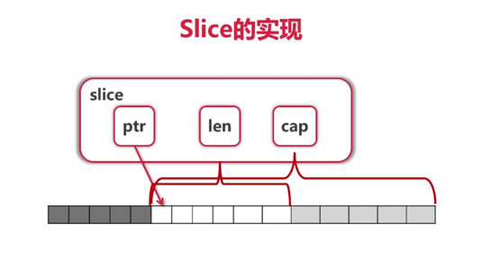

### 数组(Array)
- 需要注意的是，array在go里面是一个值类型，而**非引用类型**！
- 当你将一个array作为func的参数传入，go会复制出一个新的数组！
- 例如：
```go
package main
import "fmt"
func modifyArra(arr [5]int) {
	arr[2] = 100 // 修改item2的值
}
func main() {
	arr := [5]int{ 1, 2, 3, 4, 5 }
	modifyArra(arr)
	fmt.Printf("item %d 值为: %d\n", 2, arr[2]) // 输出"item 2 值为: 3"
}
```

- go的数组长度是固定的，声明时需确定长度，但不需要逐一赋值
- 例如：下面的声明方式都是正确的
```go
// 声明而不赋值，默认填充元素类型的零值（所谓零值就是默认值或说初始值，比如说int的零值就是0，bool的零值是false）
var arr2 [5]int

// 声明的同时为其赋值
var arr3 [5]int = [5]int{ 1, 2, 3, 4, 5 }
// 第二种声明的简写，省略掉类型（go会自动推断其类型为[5]int）
var arr4 = [5]int{ 1, 2, 3, 4, 5 }
// 继续改进，将数组长度写作[...]（go会自动计算长度推断类型）
var arr5 = [...]int{ 1, 2, 3, 4, 5 }
// 如果你不想在声明时逐一赋值，通过索引来赋值也是可以的
var arr5 = [...]int{2: 50, 5: 100}
```

### 切片
> 由于array的长度不可变，导致许多需要动态改变数据容量的场景不适用，而slice的作用就是为了满足这一需要<br />
> 个人理解：切片本质上是访问数组的一个快捷通道，对数组中的某个部分单独标注出来，赋予独立的索引。
- 与array相反，slice(切片)**是引用类型**
> 例如：向func传入一个切片，并在func中改变元素

```go
package main
import "fmt"
func modifySlice(slice []int) {
	slice[2] = 100 // 修改item2的值
}
func main() {
	slice1 := []int{ 1, 2, 3, 4, 5 }
	modifySlice(slice1)
	fmt.Printf("slice0 %v\n", slice1) // [1 2 100 4 5]
}
```

> 担心，这段代码和上面证明**array是值类型**的例子极其相似<br />
> 对比之下，就会发现，区别只有`[5]int`和`[]int`，array声明的时候写了长度，而slice没写<br />
> 两者之间，声明方式如此相似，千万注意不要搞混淆~

#### 切片和数组的关系
- 开始之前，不妨先看一张图，了解下切片的实现


> 切片即数组的一个片段，但它并不是数据的副本，只是访问数组的一个快捷通道。<br />
> 切片仅仅是存储了一个指向数组的指针，通过切片修改数据时，操作最终会映射成对数组的修改。<br />
- 例如：
```go
// 声明一个长度为 5 的数组，并为元素赋值
var data = [5]int{ 1, 2, 4, 5, 6 }
// 截取数组data索引 3 到 5 的部分作为切片
var mySlice = data[3:5]

// 那么，访问 mySlice[0] 和 data[3] 得到的值是一致的
if (mySlice[0] == data[3]) {
    fmt.Printf("data[3] = %d，mySlice[0] = %d\n", data[3], mySlice[0]) // data[3] = 5，mySlice[0] = 5
}

// 同样，通过mySlice修改数据，data也会跟着变
mySlice[1] = 100
if (mySlice[0] == data[3]) {
    fmt.Printf("data 的数据 %v\n", data) // data 的数据 [1 2 4 5 100]
}
```


#### 切片的创建和初始化：
```go
var slice2 []int
var slice3 = []int{ 1, 2, 3, 4, 5 }

// 创建方式make([]type, len, cap)，其中，type表示数组元素类型，len表示长度，cap表示容量（可不传）
slice4 := make([]int, 3, 5)

// 对切片重新切片
// 用法：slice[startIndex:endIndex]，endIndex 不得超过被截取切片容量
sliceData := []int{ 1, 2, 3, 4, 5 }
slice5 := sliceData[1:3] // 截取1到3（不包括3）
slice6 := sliceData[1:] // 从1开始，截取后面部分
slice7 := sliceData[:3] // 截取0到3（不包括3）
slice8 := sliceData[:] // 截取全部

// 对数组进行切片
// 用法：array[startIndex:endIndex]，endIndex 不得超过被截取数组的容量
arrData := [...]int{ 1, 2, 3 }
slice9 := arrData[1:3] // 截取1到3（不包括3）
slice10 := arrData[1:] // 从1开始，截取后面部分
slice11 := arrData[:3] // 截取0到3（不包括3）
slice12 := arrData[:] // 截取全部
```

#### 长度和容量
> 通过 len(slice) 获取切片长度<br />
> 通过 cap(slice) 获取切片容量
```go
sliceData2 := make([]int, 3, 5)
fmt.Printf("sliceData2 长度 %d\n", len(sliceData2)) // 3
fmt.Printf("sliceData2 容量 %d\n", cap(sliceData2)) // 5
```
> 在array里，容量和长度是相等的，数组中的每一个元素都被认为是有效数据<br />
> 但slice并不是这样，例如通过 make([]int, 5, 10) 创建一个长度5 容量10的切片<br />
> 那这个切片的数据部分长度就是5，而剩余的部分就相当于预留空间<br />
> 当长度5不再满足使用，就需要重新切片（在容量范围内），调整length(长度)

#### 重切片
> 也就是上面例子中已经提到的“对切片重新切片”
> 回顾刚刚的例子：<br />
```go
// 对切片重新切片
// 用法：slice[startIndex:endIndex]，endIndex 不得超过被截取切片容量
sliceData := []int{ 1, 2, 3, 4, 5 }
slice5 := sliceData[1:3] // 截取1到3（不包括3）
slice6 := sliceData[1:] // 从1开始，截取后面部分
slice7 := sliceData[:3] // 截取0到3（不包括3）
slice8 := sliceData[:] // 截取全部
```

- 总结来说，所谓重切片就是在切片的“容量”范围内，调整切片“长度”<br />
> 如下面的例子：
```go
var slice1 = make([]int, 5, 10) // 声明切片，长度5，容量10
fmt.Printf("长度:%d, 容量:%d, 数据:%v\n", len(slice1), cap(slice1), slice1) // 长度:5, 容量:10, 数据:[0 0 0 0 0]
// os[6] = 1 // 索引6不可访问，panic: 索引超出范围

slice2 := slice1[:8] // 重切片，切取 索引0到8(不含8)
slice2[6] = 999 // 重切片后，索引6可以访问了
fmt.Printf("长度:%d, 容量:%d, 数据:%v\n", len(slice2), cap(slice2), slice2) // 长度:5, 容量:10, 数据:[0 0 0 0 0 0 999 0]

slice3 := slice2[5:7] // 再次重切片，缩减长度，切取 索引5到7(不含7)
fmt.Printf("长度:%d, 容量:%d, 数据:%v\n", len(slice3), cap(slice3), slice3) // 长度:2, 容量:5, 数据:[0 999]
```

> 那么问题来了，如果数据非常的多，切片的“容量”也不够用了呢？<br />
> 显然，也不能一开始就将切片的容量设得非常大<br />
> 因此，当切片的容量已经不能满足需要，就得重新创建个容量更大的切片，再把已有的数据复制到新的切片<br />

#### 复制切片数据
- 使用"append(slice, items...)"向slice添加若干个值，并返回一个新的切片，不会改变原切片数据
> 当数据长度超过原slice容量时，会自动调整新slice容量
```go
slice4 := make([]int, 0, 1)
slice5 := append(slice4, 10086, 10010, 114)
fmt.Printf("长度:%d, 容量:%d, 数据:%v\n", len(slice4), cap(slice4), slice4) // 长度:0, 容量:5, 数据:[]
fmt.Printf("长度:%d, 容量:%d, 数据:%v\n", len(slice5), cap(slice5), slice5) // 长度:1, 容量:5, 数据:[10086]
```

- 使用"copy(targetSlice, sourceSlice)"，将一个切片的数据复制到另一个切片，返回复制成功的元素数量
> 例如：

```go
slice6 := make([]int, 2, 5)
slice6[0] = 10
slice6[1] = 20
slice7 := []int{4, 5, 6}
var count = copy(slice6, slice7)
if (count < 3) {
    fmt.Printf("没全部完成，只复制了：%d 个\n", count) // 没全部完成，只复制了：2 个
}
fmt.Printf("长度:%d, 容量:%d, 数据:%v\n", len(slice6), cap(slice6), slice6) // 长度:2, 容量:5, 数据:[4, 5]
```
> 尝试上面的例子，会发现只复制了两个元素，原因是 "slice6" 的容量只有2，并且是索引从0开始，直接覆盖了slice6中的数据<br />
> 由此可见，在使用copy之前，首先需要确保targetSlice长度足够

- 指定copy的覆盖位置
> 既然知道copy函数复制数据时，会从targetSlice的索引0开始开始覆盖数据，而对同一个数组的切片访问的内存都指向同一个数组<br />
> 由此，可以总结出下面的用法
```go
slice8 := []int{10, 20, 30, 40, 50}
slice9 := []int{9, 99, 999}
slice10 := slice8[2:5]
var count2 = copy(slice10, slice9)
if (count < 3) {
    fmt.Printf("没全部完成，只复制了：%d 个\n", count2) // 没全部完成，只复制了：2 个
}
fmt.Printf("长度:%d, 容量:%d, 数据:%v\n", len(slice8), cap(slice8), slice8) // 长度:2, 容量:5, 数据:[4, 5]
```
> 上面的例子中，copy的工作方式并没有改变，但由于slice10 和 slice8内存地址指向同一个数组，数据被copy 到 slice10 时，slice8 访问到的数据也保持了一致的变化

#### 注意事项：
> 1. 重切片时，startIndex不为0时，会影响到容量<br />
> 2. 对一个切片或数组重切片产生的切片，内存都指向同一个数组，而不会创建一个副本<br />
> 3. 切片被引用（未释放）时，其底层指向的数组所占用的内存无法回收。【建议将还需要的数据“复制”到一个新的切片，不要直接直接引用原来的切片】

